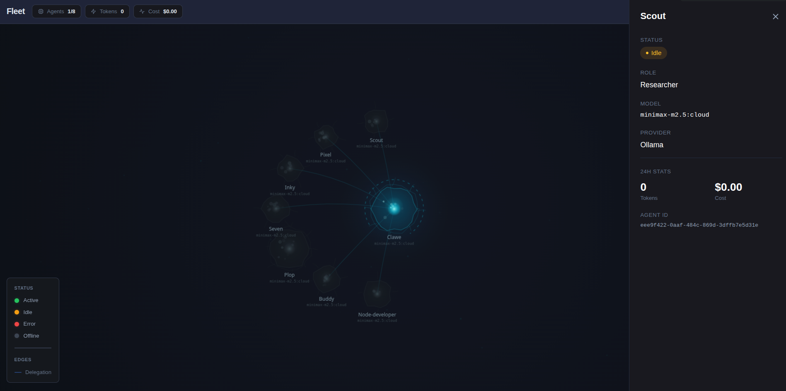

# claw-comms-logger-constellation

Agent communication visualization dashboard — see your agent squad as a living constellation of interconnected nodes.



## Quick Start

```bash
npm install
npm run dev
```

Then open http://localhost:12000/constellation

## Pages

- `/constellation` — Agent constellation visualization (nodes + edges)
- `/fleet` — Fleet/organism canvas view

## Commands

| Command       | Description                |
|---------------|----------------------------|
| `npm run dev` | Start dev server (port 1200) |
| `npm run build` | Build for production     |
| `npm start`   | Start production server   |
| `npm run lint` | Run ESLint               |

## Tech Stack

- Next.js 14 (App Router)
- TypeScript
- Tailwind CSS
- Zustand (state management)
- React Query

## Project Structure

```
src/
├── app/
│   ├── api/agents/
│   │   ├── graph/route.ts    # Graph/constellation data endpoint
│   │   └── route.ts          # Agent list endpoint
│   ├── constellation/page.tsx # Constellation view
│   ├── fleet/page.tsx         # Fleet/organism view
│   ├── globals.css
│   ├── layout.tsx
│   └── icon.svg
├── components/
│   ├── constellation/
│   │   ├── ConstellationCanvas.tsx
│   │   ├── NodeDrawer.tsx
│   │   ├── NodeTooltip.tsx
│   │   └── OrganismCanvas.tsx
│   └── shared/
│       └── StatusPill.tsx
├── hooks/
│   └── useConstellationGraph.ts
├── lib/
│   └── utils.ts
├── store/
│   └── dashboard.ts
└── types/
    └── constellation.ts
```

## API Endpoints

- `GET /api/agents` — List all agents and their status
- `GET /api/agents/graph` — Graph data (nodes + edges) for constellation view

## Agent Status Colors

| Status  | Color   |
|---------|---------|
| Active  | Green   |
| Idle    | Orange  |
| Error   | Red     |
| Offline | Gray    |

---

**Version:** 1.0.6 | **Updated:** 2026-03-18
